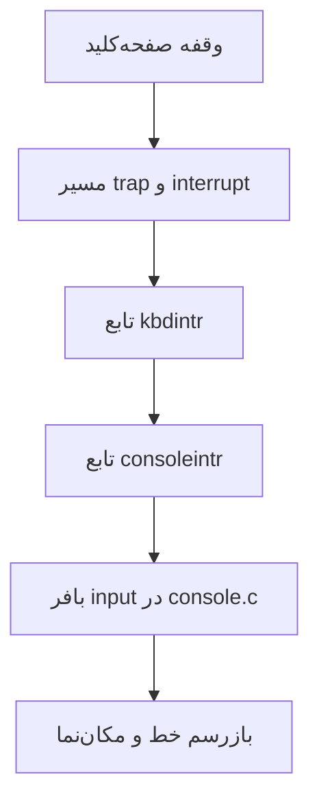

> **Provenance notice:** This is the archived originally submitted report. Runtime outputs and conclusions in this file are `Originally reported`, not automatically `Verified`. Use the phase README and current regression workflow for validated claims.

---
title: "گزارش کار پروژه اول آزمایشگاه سیستم عامل"
subtitle: "آشنایی با xv6، مسیر بوت، GDB، توسعه کنسول و برنامه find_sum"
summary: |
  در این پروژه هدف اصلی، آشنایی عملی با ساختار xv6 و مسیر اجرای آن از مرحله بوت تا اجرای برنامه‌های سطح کاربر بود. برای همین ابتدا معماری کلی سیستم‌عامل، ساختار پردازه‌ها، فایل‌ها، pipe و فراخوانی‌های پایه مانند `fork` و `exec` را بررسی کردیم. سپس xv6 را build کردیم، مسیر تولید `bootblock` و `kernel` را از روی `Makefile` دنبال کردیم، پیام بوت را برای گروه تغییر دادیم، چند قابلیت جدید به کنسول اضافه کردیم و در پایان یک برنامه سطح کاربر به نام `find_sum` نوشتیم.
authors:
  - name: "معراج رستگار - 810102576"
  - name: "علی صادقی - 810102471"
  - name: "معراج پورحسینی - 810102420"
cover_label: "گزارش کار پروژه اول"
lang: fa
dir: rtl
toc: true
cover: true
theme: modern
---

# خلاصه اجرایی

در این پروژه هدف اصلی، آشنایی عملی با ساختار xv6 و مسیر اجرای آن از مرحله بوت تا اجرای برنامه‌های سطح کاربر بود. برای همین ابتدا معماری کلی سیستم‌عامل، ساختار پردازه‌ها، فایل‌ها، pipe و فراخوانی‌های پایه مانند `fork` و `exec` را بررسی کردیم. سپس xv6 را build کردیم، مسیر تولید `bootblock` و `kernel` را از روی `Makefile` دنبال کردیم، پیام بوت را برای گروه تغییر دادیم، چند قابلیت جدید به کنسول اضافه کردیم و در پایان یک برنامه سطح کاربر به نام `find_sum` نوشتیم.

بخش مهم پروژه برای گروه ما پیاده‌سازی یک ویرایشگر خط ساده در کنسول بود. کنسول اولیه xv6 فقط امکان تایپ خطی و Backspace ساده را دارد، ولی در این پروژه قابلیت‌های حرکت مکان‌نما، حرکت کلمه‌ای، حذف آخرین کاراکتر واردشده، select، copy، paste و یک قابلیت پیشنهادی به آن اضافه شد. در پیاده‌سازی تلاش کردیم رفتار کلیدها فقط برای حالت ساده درست نباشد، بلکه در حالت‌های ترکیبی نیز قابل پیش‌بینی بماند.


> [!NOTE]
> در این گزارش تلاش شده است هر قابلیت کنسول هم از نظر ایده و هم از نظر مسیر پیاده‌سازی در xv6 توضیح داده شود؛ بنابراین متن فقط خروجی نهایی را نشان نمی‌دهد و منطق تغییرات را هم توضیح می‌دهد.

نمودار زیر دید کلی مسیر دریافت ورودی از صفحه‌کلید تا تغییر بافر کنسول را نشان می‌دهد:



# فایل‌های اصلی تغییر داده‌شده

| فایل | نقش در پروژه |
|---|---|
| `init.c` | چاپ نام گروه/دانشجو در پیام بوت |
| `console.c` | پیاده‌سازی ویرایش خط، حرکت مکان‌نما، Ctrl+A، Ctrl+D، Ctrl+Z، select/copy/paste و autocomplete |
| `kbd.c` و `kbd.h` | تبدیل scancode کلیدهای جهت‌دار به کد قابل فهم برای کنسول |
| `defs.h` | اضافه شدن اعلان چند تابع مورد استفاده در کنسول |
| `Makefile` | اضافه شدن برنامه `find_sum` به `UPROGS` و اجرای قابل اعتماد اسکریپت‌های Perl |
| `find_sum.c` | برنامه سطح کاربر برای استخراج و جمع زدن عددهای ورودی و نوشتن نتیجه در فایل |

# اجرای xv6 و پیام بوت

برای build کردن پروژه از دستورهای زیر استفاده شد:

```bash title="ساخت xv6" linenos
make clean
make
make fs.img
```

بعد از اجرای سیستم‌عامل در QEMU، پیام بوت شامل نام اعضای گروه چاپ می‌شود. این تغییر در فایل `init.c` و قبل از اجرای shell انجام شده است. متن چاپ‌شده در سورس با حروف انگلیسی نوشته شده تا در کنسول ساده xv6 بدون مشکل نمایش داده شود:

```c title="init.c" linenos
printf(1, "    Modified by group:\n");
printf(1, "    Meraj Rastegar 810102576\n");
printf(1, "    Ali Sadeghi 810102471\n");
printf(1, "    Meraj Pourhosseini 810102420\n\n");
```

نمونه خروجی مورد انتظار پس از بوت:

```text title="نمونه خروجی بوت"
xv6...
cpu0: starting 0
sb: size ...
    Modified by group:
    Meraj Rastegar 810102576
    Ali Sadeghi 810102471
    Meraj Pourhosseini 810102420

init: starting sh
$
```

# پاسخ پرسش‌های مفهومی بخش xv6

## ۱. سه وظیفه اصلی سیستم‌عامل

سه وظیفه اصلی سیستم‌عامل را می‌توان این‌طور خلاصه کرد:

1. **مدیریت منابع سخت‌افزاری** مانند CPU، حافظه، دیسک و دستگاه‌های ورودی/خروجی.
2. **ایجاد انتزاع برای برنامه‌ها**؛ مثلاً برنامه به جای کار مستقیم با دیسک، از فایل و file descriptor استفاده می‌کند.
3. **حفاظت و جداسازی**؛ یعنی برنامه‌ها نباید بتوانند حافظه یا منابع یکدیگر و هسته را به شکل دلخواه خراب کنند.

در xv6 این سه وظیفه در قالب مدیریت پردازه‌ها، حافظه مجازی، فایل‌سیستم، syscallها و trapها دیده می‌شود.

## ۲. آیا همه دستگاه‌ها به سیستم‌عامل نیاز دارند؟

وجود سیستم‌عامل برای همه دستگاه‌ها الزامی نیست. اگر یک دستگاه فقط یک کار ثابت و ساده انجام دهد، ممکن است برنامه آن به صورت bare-metal و بدون سیستم‌عامل اجرا شود؛ مثلاً بعضی میکروکنترلرهای بسیار ساده. اما وقتی چند برنامه یا چند فعالیت هم‌زمان داریم، نیاز به فایل‌سیستم، مدیریت حافظه، ارتباط با دستگاه‌های مختلف، حفاظت، زمان‌بندی یا واسط برنامه‌نویسی پایدار وجود دارد، استفاده از سیستم‌عامل لازم و منطقی می‌شود.

## ۳. معماری سیستم‌عامل xv6

سامانه xv6 از نظر طراحی یک سیستم‌عامل با **هسته یکپارچه** یا monolithic kernel است. دلیل این برداشت این است که بخش‌هایی مثل مدیریت پردازه، حافظه، فایل‌سیستم، pipe، device driverها و syscall handlerها همگی داخل فضای هسته اجرا می‌شوند و به صورت یک kernel واحد link می‌شوند. در عین حال، xv6 مرز user/kernel را حفظ می‌کند و برنامه‌های کاربر فقط از طریق trap و system call وارد هسته می‌شوند.

پس xv6 microkernel نیست، چون سرویس‌های اصلی مانند فایل‌سیستم و مدیریت پردازه در فرآیندهای جداگانه user-space اجرا نمی‌شوند.

## ۴. سیستم عامل xv6 تک‌وظیفه‌ای است یا چندوظیفه‌ای؟

سامانه xv6 یک سیستم چندوظیفه‌ای است. چند پردازه می‌توانند هم‌زمان در سیستم وجود داشته باشند و scheduler بین پردازه‌های `RUNNABLE` جابه‌جا می‌شود. در یک لحظه روی هر CPU فقط یک پردازه اجرا می‌شود، اما با وقفه تایمر و context switch، پردازه‌ها به صورت نوبتی CPU را دریافت می‌کنند.

## ۵. تفاوت برنامه و پردازه

**برنامه** یک موجودیت غیرفعال است؛ مثلاً فایل اجرایی `ls` روی دیسک. **پردازه** اجرای فعال یک برنامه است و علاوه بر کد برنامه، وضعیت اجرایی دارد؛ مانند address space، ثبات‌ها، stack، heap، فایل‌های باز، pid، parent و وضعیت زمان‌بندی. ممکن است از یک برنامه چند پردازه جدا ساخته شود.

## ۶. ساختار پردازه در xv6 و اختصاص CPU

در xv6 اطلاعات هر پردازه در `struct proc` داخل `proc.h` نگهداری می‌شود. بخش‌های مهم آن عبارت‌اند از:

| فیلد | توضیح |
|---|---|
| `sz` | اندازه حافظه پردازه |
| `pgdir` | بخش page table پردازه |
| `kstack` | بخش stack هسته مخصوص پردازه |
| `state` | وضعیت پردازه مانند `RUNNABLE` یا `SLEEPING` |
| `pid` | شناسه پردازه |
| `parent` | اشاره‌گر به پردازه والد |
| `tf` | ایجاد trapframe برای برگشت از trap/syscall به user mode |
| `context` | ایجاد context لازم برای `swtch` |
| `chan` | کانالی که پردازه روی آن خوابیده است |
| `killed` | علامت کشته شدن پردازه |
| `ofile[]` | فایل‌های باز پردازه |
| `cwd` | دایرکتوری جاری |
| `name` | نام پردازه برای debug |

پردازنده توسط تابع `scheduler` در `proc.c` بین پردازه‌های `RUNNABLE` تقسیم می‌شود. scheduler جدول پردازه‌ها را بررسی می‌کند، یک پردازه آماده را انتخاب می‌کند، وضعیت آن را `RUNNING` می‌کند و با `swtch` از context زمان‌بند به context پردازه می‌رود. وقتی پردازه yield کند، sleep شود یا exit کند، کنترل دوباره به scheduler برمی‌گردد.

## ۷. مفهوم file descriptor و pipe

در سیستم‌های UNIX-like، file descriptor یک عدد صحیح کوچک است که در سطح کاربر به عنوان handle فایل استفاده می‌شود. در xv6 هر پردازه آرایه‌ای به نام `ofile` دارد و file descriptor در واقع اندیس همین آرایه است. هر خانه به یک `struct file` اشاره می‌کند که ممکن است فایل معمولی، pipe یا device باشد.

`pipe` یک کانال ارتباطی درون هسته می‌سازد و دو file descriptor برمی‌گرداند: یکی برای خواندن و یکی برای نوشتن. کاربرد معمول pipe وصل کردن خروجی یک برنامه به ورودی برنامه دیگر است؛ مانند:

```sh
ls | grep x
```

در xv6 pipe با یک بافر داخلی و مکانیزم `sleep`/`wakeup` کار می‌کند؛ اگر pipe خالی باشد خواننده می‌خوابد و اگر پر باشد نویسنده منتظر می‌ماند.

## ۸. عملکرد `fork` و `exec` و علت جدا بودن آن‌ها

`fork` یک پردازه جدید می‌سازد که در ابتدا کپی پردازه والد است. child همان address space، فایل‌های باز و بسیاری از وضعیت‌های والد را به شکل کپی‌شده دریافت می‌کند، ولی pid جدا دارد. مقدار برگشتی `fork` در والد pid فرزند و در فرزند صفر است.

`exec` برنامه فعلی پردازه را با یک فایل اجرایی جدید جایگزین می‌کند. pid و بسیاری از منابع پردازه مثل فایل‌های باز حفظ می‌شوند، اما address space با کد و داده برنامه جدید جایگزین می‌شود.

جدا بودن `fork` و `exec` از نظر طراحی برای shell بسیار مفید است. shell می‌تواند ابتدا `fork` کند، سپس قبل از `exec` در فرزند redirection یا pipe را تنظیم کند و بعد برنامه جدید را اجرا کند. اگر این دو ادغام شده بودند، پیاده‌سازی pipe و redirection سخت‌تر و غیرانعطاف‌پذیرتر می‌شد.

# بررسی `make -n`

با اجرای `make -n` دستورهای build بدون اجرا شدن چاپ می‌شوند. دستور اصلی ساخت فایل نهایی هسته این دستور link است:

```bash
ld -m elf_i386 -T kernel.ld -o kernel entry.o bio.o console.o exec.o file.o fs.o ide.o ioapic.o kalloc.o kbd.o lapic.o log.o main.o mp.o picirq.o pipe.o proc.o sleeplock.o spinlock.o string.o swtch.o syscall.o sysfile.o sysproc.o trapasm.o trap.o uart.o vectors.o vm.o -b binary initcode entryother
```

بعد از آن فایل `kernel` با `objdump` برای تولید `kernel.asm` و `kernel.sym` استفاده می‌شود و در نهایت داخل `xv6.img` نوشته می‌شود.

# پیاده‌سازی قابلیت‌های کنسول

## مدل کلی ویرایش خط

در xv6 معمولی ساختار ورودی کنسول شامل `buf`, `r`, `w`, `e` است. در این پروژه علاوه بر این سه اندیس، یک موقعیت منطقی برای مکان‌نما نگه داشته شد:

```c
static int curpos;
```

`curpos` مکان cursor در خط فعلی را نشان می‌دهد، نه لزوماً انتهای خط. بنابراین insert و delete باید بتوانند وسط خط را تغییر دهند. برای این کار چند تابع کمکی نوشته شد:

- `line_len()` برای طول خط فعلی؛
- `line_get()` و `line_set()` برای دسترسی به کاراکترهای خط؛
- `insert_bytes_at()` برای insert در هر موقعیت؛
- `delete_range_at()` برای حذف یک بازه؛
- `redraw_input()` برای بازکشیدن خط روی صفحه.

با این مدل، بافر ورودی همچنان همان بافر xv6 است، ولی روی آن یک لایه ویرایش خط ساده قرار گرفته است.

## حرکت مکان‌نما با چپ و راست

برای دریافت کلیدهای جهت‌دار، در `kbd.c` scancodeهای extended به دو مقدار داخلی تبدیل شدند:

```c
if(c == KEY_LF)
  return LEFT_ARROW;
if(c == KEY_RT)
  return RIGHT_ARROW;
```

در `console.c` اگر کاربر چپ یا راست را بزند، فقط `curpos` تغییر می‌کند و سپس cursor فیزیکی CGA به موقعیت متناظر منتقل می‌شود. حرکت از ابتدا به چپ و از انتهای خط به راست مجاز نیست.

## حرکت کلمه‌ای با `Ctrl+A` و `Ctrl+D`

برای `Ctrl+D` از موقعیت فعلی تا پایان کلمه جلو می‌رویم و سپس فاصله‌ها رد می‌شوند تا cursor روی ابتدای کلمه بعدی قرار بگیرد. برای `Ctrl+A` اگر وسط یک کلمه باشیم به ابتدای همان کلمه می‌رویم؛ اگر روی فاصله یا ابتدای کلمه باشیم، ابتدا فاصله‌های قبلی رد می‌شوند و بعد به ابتدای کلمه قبل می‌رویم. معیار جدا شدن کلمه‌ها، یک یا چند space در نظر گرفته شده است.

## حذف آخرین کاراکتر واردشده با `Ctrl+Z`

در صورت پروژه تاکید شده بود که `Ctrl+Z` باید آخرین کاراکتر واردشده از نظر زمانی را حذف کند، حتی اگر cursor جای دیگری باشد. برای پیاده‌سازی این رفتار، برای هر کاراکتر یک timestamp داخلی نگه داشته شد:

```c
static int input_stamp[INPUT_BUF];
static int next_input_stamp = 1;
```

هر بار که کاراکتری وارد می‌شود، stamp جدید می‌گیرد. هنگام `Ctrl+Z` کل خط بررسی می‌شود و کاراکتری که بزرگ‌ترین stamp را دارد حذف می‌شود. با این روش اگر مثلاً کاربر ابتدا `abc` را تایپ کند، بعد cursor را وسط خط ببرد و `X` را وارد کند، با `Ctrl+Z` فقط `X` حذف می‌شود.

## انتخاب متن، کپی و چسباندن

برای select دو مرحله تعریف شد. با `Ctrl+S` اول، anchor انتخاب ذخیره می‌شود. تا زمانی که `Ctrl+S` دوم زده نشده، کاربر می‌تواند همچنان خط را ویرایش کند. اگر قبل از anchor کاراکتر اضافه یا حذف شود، anchor هم به‌روزرسانی می‌شود تا به همان موقعیت منطقی متن اشاره کند.

با `Ctrl+S` دوم، بازه بین anchor و cursor انتخاب می‌شود. در حالت انتخاب نهایی، بازه انتخاب‌شده با attribute متفاوت روی CGA نمایش داده می‌شود. برای نگهداری clipboard از آرایه زیر استفاده شد:

```c
static char selected_buffer[INPUT_BUF];
```

رفتار کلیدها در حالت selection نهایی مطابق صورت پروژه است:

| کلید | رفتار |
|---|---|
| کلید Backspace | حذف کل متن انتخاب‌شده |
| کلیدهای Ctrl+C | کپی کردن متن بدون خارج شدن از حالت انتخاب |
| کلید های Ctrl+V | جایگزین کردن متن انتخاب‌شده با clipboard |
| کاراکتر عادی | جایگزین کردن selection با همان کاراکتر |
| کلیدهای دیگر | فقط deselect، بدون اجرای خود کلید |

## قابلیت پیشنهادی: autocomplete با Tab

برای قابلیت اختیاری کنسول، autocomplete ساده با کلید `Tab` پیاده‌سازی شد. اگر کاربر بخشی از نام یک دستور یا فایل شناخته‌شده را نوشته باشد، با Tab کامل می‌شود. اگر چند گزینه وجود داشته باشد، طولانی‌ترین prefix مشترک تکمیل می‌شود و اگر تکمیل مشترک ممکن نباشد، گزینه‌ها چاپ می‌شوند.

برای مثال:

```text
$ fi<Tab>
$ find_sum
```

دو ایده دیگری که برای توسعه کنسول قابل پیاده‌سازی هستند:

1. **تاریخچه دستورات** با کلیدهای بالا و پایین، مشابه shellهای معمولی.
2. **جست‌وجوی معکوس در history** با `Ctrl+R`.

# برنامه سطح کاربر `find_sum`

برنامه `find_sum` در سطح user نوشته شد و به `UPROGS` در `Makefile` اضافه شد. این برنامه همه آرگومان‌های ورودی را پیمایش می‌کند، هر دنباله رقم را به عنوان عدد می‌خواند و مجموع اعداد را در فایل `result.txt` می‌نویسد.

نمونه اجرا:

```sh
$ find_sum abc12 7x 30
$ cat result.txt
49
```

در xv6، باز کردن فایل با `O_CREATE | O_WRONLY` فایل قبلی را truncate نمی‌کند. بنابراین قبل از نوشتن نتیجه، فایل قبلی حذف می‌شود:

```c
unlink("result.txt");
fd = open("result.txt", O_CREATE | O_WRONLY);
```

این کار باعث می‌شود اگر اجرای قبلی خروجی بلندتری داشته باشد، ته‌مانده آن در فایل جدید باقی نماند.

# تست‌های انجام‌شده برای کنسول

| سناریو | ورودی | انتظار |
|---|---|---|
| اعمال insert وسط خط | `abc`، دو بار Left، سپس `X` | خروجی `aXbc` |
| حذف زمانی | `abc`، رفتن به وسط، تایپ `X`، سپس `Ctrl+Z` | حذف `X` و باقی ماندن `abc` |
| حرکت کلمه‌ای | `one two three` و `Ctrl+A`/`Ctrl+D` | جابه‌جایی بین ابتدای کلمه‌ها |
| انتخاب و حذف | انتخاب `two` و Backspace | حذف کامل `two` |
| انتخاب و copy | انتخاب یک بازه و `Ctrl+C` | متن انتخاب‌شده باقی می‌ماند و clipboard پر می‌شود |
| اعمال paste روی selection | انتخاب یک بازه و `Ctrl+V` | بازه با clipboard جایگزین می‌شود |
| کلید غیرمجاز روی selection | انتخاب یک بازه و زدن Left یا Ctrl+Z | فقط deselect انجام می‌شود |
| اعمال autocomplete | نوشتن prefix دستور و زدن Tab | تکمیل prefix یا نمایش گزینه‌ها |

# پاسخ پرسش‌های بوت

## ۱۲. در سکتور نخست دیسک قابل بوت چه فایلی قرار دارد؟

در سکتور نخست دیسک قابل بوت، محتوای فایل `bootblock` قرار می‌گیرد. این فایل از `bootasm.S` و `bootmain.c` ساخته می‌شود، سپس با `objcopy` به binary خام تبدیل می‌شود و در نهایت با `sign.pl` امضای bootable دریافت می‌کند. دستورهای مربوط در `make -n` دیده می‌شوند:

```bash
ld -m elf_i386 -N -e start -Ttext 0x7C00 -o bootblock.o bootasm.o bootmain.o
objcopy -S -O binary -j .text bootblock.o bootblock
perl sign.pl bootblock
```

## ۱۳. نوع فایل دودویی boot و تفاوت آن با فایل‌های دیگر xv6

فایل نهایی `bootblock` یک binary خام و ۵۱۲ بایتی است، نه یک فایل ELF معمولی. دلیل آن این است که BIOS فقط سکتور اول دیسک را در آدرس `0x7C00` می‌خواند و اجرا می‌کند و loader پیچیده‌ای برای خواندن headerهای ELF ندارد. در مقابل، `kernel` و برنامه‌های user ابتدا به صورت ELF ساخته می‌شوند و ساختار بخش‌ها، symbolها و metadata دارند.

برای دیدن اسمبلی bootblock می‌توان از `objdump` روی `bootblock.o` یا روی binary خام استفاده کرد. خروجی بخش ابتدایی باید مشابه کدهای `bootasm.S` باشد، زیرا شروع بوت از همان کد اسمبلی است.

## ۱۴. علت استفاده از `objcopy`

`objcopy` برای تبدیل خروجی ELF به binary خام استفاده می‌شود. در مرحله ساخت bootblock، فایل link شده هنوز header و metadata دارد، اما BIOS باید فقط کد خام boot sector را بخواند. بنابراین با دستور زیر فقط بخش text استخراج می‌شود:

```bash
objcopy -S -O binary -j .text bootblock.o bootblock
```

## ۱۵. چرا بوت فقط با C نوشته نشده است؟

در ابتدای بوت هنوز محیط اجرای زبان C آماده نیست. CPU در real mode است، segmentها و stack باید تنظیم شوند، A20 باید فعال شود و برای ورود به protected mode باید GDT و ثبات‌های کنترلی مقداردهی شوند. این کارها نیاز به دستورهای دقیق اسمبلی دارند. بعد از آماده شدن حداقل محیط لازم، ادامه کار مثل خواندن ELF هسته از دیسک در `bootmain.c` با C انجام می‌شود.

## ۱۶. نمونه ثبات‌های x86

| نوع ثبات | نمونه | وظیفه |
|---|---|---|
| عام‌منظوره | `eax` | محاسبات، مقدار برگشتی تابع‌ها و syscallها |
| قطعه | `cs` | مشخص کردن code segment جاری |
| وضعیت | `eflags` | نگهداری flagهایی مثل Zero Flag، Carry Flag و Interrupt Flag |
| کنترلی | `cr0` | فعال‌سازی protected mode و کنترل ویژگی‌های اصلی پردازنده |

## ۱۷. حالت real mode و نقص اصلی آن

پردازنده‌های x86 هنگام reset در real mode شروع می‌کنند تا با نرم‌افزارها و BIOS قدیمی سازگار باشند. در real mode آدرس‌دهی ساده و ۲۰ بیتی است و محافظت واقعی بین برنامه‌ها وجود ندارد. نقص اصلی این mode نبود memory protection، نبود privilege جدی و محدودیت آدرس‌دهی است.

در معماری‌هایی مثل ARM و RISC-V نیز سطح‌های privilege وجود دارد، اما ساختار آن‌ها مانند real/protected mode تاریخی x86 نیست. مثلاً RISC-V سطح‌هایی مثل Machine/Supervisor/User دارد و ARM نیز modeها و exception levelهای خودش را دارد.

## ۱۸. حالت protected mode چیست؟

حالت protected mode امکان آدرس‌دهی ۳۲ بیتی، سطح دسترسی، حفاظت حافظه، segmentation و paging را فراهم می‌کند. سیستم‌عامل بعد از انجام کارهای اولیه بوت، پردازنده را وارد protected mode می‌کند تا بتواند هسته و برنامه‌های کاربر را با جداسازی و کنترل بیشتری اجرا کند. در xv6 این تغییر در `bootasm.S` انجام می‌شود.

## ۱۹. چرا هسته از آدرس `0x100000` بارگذاری می‌شود؟

آدرس `0x100000` همان مرز ۱MB است. پایین‌تر از این محدوده بخش‌هایی مانند interrupt vector table، BIOS data area، حافظه ویدئویی و کد bootloader قرار می‌گیرند. اگر هسته از صفر بارگذاری شود، ممکن است این نواحی مهم را خراب کند. همچنین قرار دادن هسته در ۱MB یک قرارداد رایج برای kernelهای x86 است و با link script xv6 هماهنگ است.

# پاسخ پرسش‌های GDB

## ۲۰. مشاهده Breakpointها

برای مشاهده breakpointها از دستور زیر استفاده می‌شود:

```gdb
info breakpoints
```

یا به شکل کوتاه‌تر:

```gdb
info b
```

## ۲۱. حذف Breakpoint

برای حذف یک breakpoint می‌توان شماره آن را از خروجی `info breakpoints` برداشت و دستور زیر را اجرا کرد:

```gdb
delete 1
```

اگر شماره داده نشود، GDB برای حذف همه breakpointها تایید می‌گیرد. همچنین با `clear file:line` یا `clear function` می‌توان breakpoint مربوط به یک محل مشخص را حذف کرد.

## ۲۲. خروجی `bt`

دستور `bt` یا `backtrace` زنجیره فراخوانی تابع‌ها را نشان می‌دهد. مثلاً اگر درون تابع `consoleintr` توقف کنیم، `bt` نشان می‌دهد از چه مسیر تابعی به این نقطه رسیده‌ایم. این دستور برای فهمیدن مسیر رسیدن برنامه به خطا بسیار مهم است.

## ۲۳. تفاوت `x` و `print`

دو تفاوت اصلی:

1. `print` یک expression زبان C را ارزیابی می‌کند و نتیجه را با نوع داده‌ای مناسب نمایش می‌دهد؛ ولی `x` حافظه را از یک آدرس مشخص examine می‌کند.
2. `x` برای دیدن raw memory با قالب و اندازه دلخواه مناسب است؛ مثلاً `x/16xw $esp` شانزده word از stack را hexadecimal نشان می‌دهد. `print` بیشتر برای متغیرها، pointerها و expressionها مناسب است.

برای چاپ یک ثبات خاص می‌توان نوشت:

```gdb
p $eax
```

یا:

```gdb
info registers eax
```

## ۲۴. نمایش ثبات‌ها، متغیرهای محلی و نقش `edi` و `esi`

برای نمایش ثبات‌ها:

```gdb
info registers
```

برای نمایش متغیرهای محلی frame فعلی:

```gdb
info locals
```

در x86، ثبات `esi` معمولاً Source Index و ثبات `edi` معمولاً Destination Index است. این دو در دستورهای رشته‌ای و کپی حافظه مانند `movs` کاربرد تاریخی دارند، هرچند در کدهای معمولی کامپایلر می‌تواند از آن‌ها به عنوان ثبات عمومی هم استفاده کند.

## ۲۵. ساختار `struct input`

در xv6 ساختار input در `console.c` برای مدیریت ورودی کنسول استفاده می‌شود:

```c
struct {
  char buf[INPUT_BUF];
  uint r;
  uint w;
  uint e;
} input;
```

نقش فیلدها:

| فیلد | نقش |
|---|---|
| `buf` | بافر حلقوی ورودی کنسول |
| `r` | محل خواندن بعدی توسط `consoleread` |
| `w` | انتهای داده‌ای که برای خواندن آماده شده است |
| `e` | انتهای خطی که در حال ویرایش است |

هنگام تایپ کاراکتر، `e` جلو می‌رود. وقتی کاربر Enter می‌زند، خط کامل می‌شود و `w = e` می‌شود تا reader بتواند آن را بخواند. وقتی `consoleread` کاراکترها را تحویل برنامه user می‌دهد، `r` جلو می‌رود. در پروژه حاضر برای پشتیبانی از ویرایش وسط خط، کنار این ساختار یک `curpos` و چند آرایه کمکی هم نگه داشته شد.

## ۲۶. خروجی `layout src` و `layout asm`

در TUI مربوط به GDB، دستور زیر نمای کد منبع C را باز می‌کند:

```gdb
layout src
```

و دستور زیر نمای اسمبلی اطراف محل توقف فعلی را نشان می‌دهد:

```gdb
layout asm
```

وقتی در حال بررسی کدهای کم‌سطح مثل boot یا trap هستیم، `layout asm` مفیدتر است. وقتی در تابع‌های C مانند `consoleintr` یا `syscall` هستیم، `layout src` خواناتر است.

## ۲۷. جابه‌جایی در زنجیره فراخوانی

برای جابه‌جایی بین frameهای backtrace از دستورهای زیر استفاده می‌شود:

```gdb
up
down
frame 2
```

`up` به سمت caller می‌رود، `down` به سمت callee برمی‌گردد و `frame N` یک frame مشخص را انتخاب می‌کند.


# اعتبارسنجی نهایی و سلامت تحویل

در بازبینی نهایی، پروژه از نظر ساختار تحویل، قابلیت build و مسیر `dist` دوباره بررسی شد. نتیجه نهایی به این صورت است:

| مورد بررسی | نتیجه |
|---|---|
| `make clean` | موفق |
| `make` | موفق |
| `make fs.img` | موفق |
| `make dist` | موفق |
| `cd dist && make fs.img` | موفق |
| dry-run اجرای `CPUS=4` | تولید topology صریح برای QEMU با `-smp cpus=4,cores=1,threads=1,sockets=4` |

در این مرحله، فایل `Makefile` نیز از نظر self-contained بودن خروجی `dist` اصلاح شد؛ به‌طور مشخص `find_sum.c` و `picirq.c` در `EXTRA` قرار گرفتند تا اگر مصحح از خروجی `make dist` پروژه را دوباره build کند، برنامه `_find_sum` و kernel objectهای لازم بدون خطا ساخته شوند.

برای اجرای سریع پروژه:

```sh
make clean
make fs.img
make CPUS=1 qemu-nox
```

پس از بالا آمدن xv6، برنامه زیر باید داخل shell موجود باشد:

```sh
find_sum result.txt 12 abc -5 7
```

انتظار می‌رود مجموع عددهای ورودی در فایل خروجی نوشته شود.


# جمع‌بندی

در این پروژه ابتدا ساختار پایه xv6 و مسیر بوت آن بررسی شد. سپس با تغییر `init.c` پیام بوت با مشخصات گروه شخصی‌سازی شد. در بخش اصلی پیاده‌سازی، کنسول xv6 از یک ورودی خطی ساده به یک line editor کوچک تبدیل شد که حرکت cursor، حرکت کلمه‌ای، حذف زمانی، select/copy/paste و autocomplete را پشتیبانی می‌کند. برنامه user-space `find_sum` نیز برای تمرین اجرای برنامه‌های سطح کاربر روی xv6 اضافه شد. در کنار پیاده‌سازی، سوال‌های مربوط به معماری xv6، boot و GDB نیز پاسخ داده شدند تا ارتباط بین کد عملی و مفاهیم سیستم‌عامل روشن باشد.
