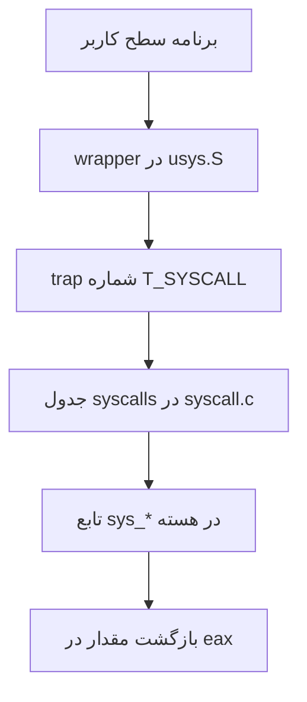

# خلاصه اجرایی

هدف پروژه دوم، آشنایی عملی با مسیر اجرای system call در xv6 و اضافه کردن چند فراخوانی سیستمی جدید به هسته بود. در xv6 برنامه‌های user-space برای انجام کارهای حساس مانند دسترسی به فایل‌سیستم، دریافت اطلاعات پردازه‌ها یا استفاده از داده‌های داخلی هسته، مستقیماً به ساختارهای kernel دسترسی ندارند و باید از system call استفاده کنند.

در این پروژه ابتدا مسیر فراخوانی syscall از `usys.S` تا `syscall.c` و سپس تابع‌های `sys_*` بررسی شد. بعد سه بخش عملی پیاده‌سازی شد:

1. مولد عدد شبه‌تصادفی در هسته با syscallهای `setSeed` و `getRandomNumber`؛
2. نمایش اطلاعات پردازه با syscall `process_information`؛
3. مرتب‌سازی اعداد داخل هسته با syscall `sort_numbers` و مقایسه آن با پیاده‌سازی user-space.


> [!NOTE]
> در این پروژه هر فراخوانی سیستمی از دو طرف بررسی شده است: از سمت برنامه کاربر که تابعی معمولی را صدا می‌زند و از سمت هسته که آرگومان‌ها را بررسی می‌کند و عملیات اصلی را انجام می‌دهد.

نمودار زیر مسیر کلی ورود یک برنامه کاربر به هسته را برای فراخوانی‌های سیستمی این پروژه خلاصه می‌کند:



رابطه ساده‌ای که برای مولد شبه‌تصادفی استفاده می‌شود از نوع خطی هم‌نهشتی است و به صورت زیر در نظر گرفته می‌شود:

$$
\begin{aligned}
{}X_{n+1} &= (aX_n + c) \bmod m
\end{aligned}
$$

# مسیر کلی اضافه کردن system call در xv6

برای اضافه کردن هر system call جدید، چند فایل باید با هم هماهنگ شوند. در این پروژه همین مسیر برای چهار syscall جدید انجام شد:

| فایل | کاری که انجام شد |
|---|---|
| `syscall.h` | تعریف شماره syscallهای جدید |
| `syscall.c` | معرفی prototype تابع‌های `sys_*` و اضافه کردن آن‌ها به آرایه `syscalls[]` |
| `sysproc.c` | پیاده‌سازی syscallهای مربوط به پردازه و random |
| `sysfile.c` | پیاده‌سازی syscall مربوط به sort فایل |
| `user.h` | اضافه کردن prototype قابل استفاده در برنامه‌های سطح کاربر |
| `usys.S` | ساخت wrapper اسمبلی با ماکروی `SYSCALL` |
| `Makefile` | اضافه کردن برنامه‌های تست به `UPROGS` |

شماره‌های اضافه‌شده در پروژه به این صورت هستند:

```c title="syscall.h" linenos
#define SYS_setSeed              22
#define SYS_getRandomNumber      23
#define SYS_process_information  24
#define SYS_sort_numbers         25
```

در `usys.S` نیز برای هر کدام wrapper ساخته شد:

```asm title="usys.S" linenos
SYSCALL(setSeed)
SYSCALL(getRandomNumber)
SYSCALL(process_information)
SYSCALL(sort_numbers)
```

بنابراین برنامه user بدون دانستن جزئیات trap و شماره syscall فقط تابعی مثل `setSeed()` را صدا می‌زند.

# پاسخ پرسش‌های تئوری system call

## پرسش ۱. نقش کتابخانه‌های سطح کاربر و wrapperها

در xv6 برنامه user مستقیماً دستور `int` را نمی‌نویسد. در فایل `usys.S` یک ماکرو به نام `SYSCALL` وجود دارد که برای هر syscall یک تابع wrapper می‌سازد. این wrapper شماره syscall را در ثبات `eax` قرار می‌دهد و سپس trap مربوط به syscall را اجرا می‌کند:

```asm title="wrapper فراخوانی سیستمی" linenos
movl $SYS_name, %eax
int $T_SYSCALL
ret
```

از طرف دیگر، `user.h` prototype تابع‌ها را در اختیار برنامه‌نویس می‌گذارد. بنابراین برنامه‌نویس به جای دانستن شماره syscall، شکل پشته، trap number و ABI، فقط تابعی مثل `getpid()` یا `sort_numbers(path)` را صدا می‌زند.

این انتزاع سه فایده دارد:

1. **سادگی برنامه‌نویسی:** کاربر با تابع معمولی C کار می‌کند.
2. **قابلیت حمل بهتر:** اگر شماره یا روش فراخوانی syscall تغییر کند، برنامه user تغییر زیادی نمی‌خواهد.
3. **امنیت و کنترل:** ورود به kernel فقط از مسیرهای مشخص و کنترل‌شده انجام می‌شود.

## پرسش ۲. روش‌های دیگر ارتباط user space با kernel در لینوکس

در لینوکس نیز system call پایه اصلی ارتباط با kernel است، اما چند interface سطح بالاتر وجود دارد که برنامه‌ها از طریق آن‌ها با kernel تعامل می‌کنند:

- **فایل‌های device در `/dev`:** برنامه با خواندن و نوشتن روی فایل دستگاه با driver ارتباط می‌گیرد.
- **`ioctl`:** برای ارسال فرمان‌های کنترلی خاص به driverها استفاده می‌شود.
- **`procfs` و `sysfs`:** اطلاعات kernel و deviceها را به صورت فایل‌مانند نمایش می‌دهند؛ مثلاً `/proc` و `/sys`.
- **`mmap`:** برای نگاشت حافظه مشترک یا memory-mapped I/O به فضای user کاربرد دارد.
- **سوکت netlink:** برای ارتباط ساخت‌یافته بین user-space و kernel در بخش‌هایی مثل شبکه استفاده می‌شود.
- **سیگنال‌ها:** kernel با signal می‌تواند رخدادهایی را به پردازه اطلاع دهد.
- **سازوکار vDSO:** برای بعضی عملیات سبک و پرتکرار، kernel کدی را در فضای user map می‌کند تا بدون trap کامل اجرا شود.

بسیاری از این interfaceها در نهایت روی syscallهای پایه مثل `open`, `read`, `write`, `mmap` یا `ioctl` سوار هستند، ولی از دید برنامه‌نویس یک روش ارتباطی جدا و سطح بالاتر محسوب می‌شوند.

## پرسش ۳. چرا فقط syscall با `DPL_USER` فعال است؟

در x86 هر gate در IDT سطح دسترسی دارد. syscall باید از user mode قابل اجرا باشد، چون برنامه user باید بتواند آگاهانه از kernel سرویس بگیرد. بنابراین gate مربوط به `T_SYSCALL` با `DPL_USER` تنظیم می‌شود.

اما وقفه‌های سخت‌افزاری و بیشتر exceptionها نباید توسط برنامه user به صورت دلخواه قابل فراخوانی باشند. اگر کاربر می‌توانست هر interrupt gate را با سطح user اجرا کند، می‌توانست مسیرهای حساس kernel را خارج از شرایط واقعی فعال کند و امنیت و پایداری سیستم را از بین ببرد. وقفه سخت‌افزاری باید از سمت سخت‌افزار بیاید و exception نیز باید نتیجه یک رخداد واقعی پردازنده مثل page fault یا divide-by-zero باشد.

## پرسش ۴. چرا `ss` و `esp` فقط هنگام تغییر سطح دسترسی push می‌شوند؟

وقتی trap باعث تغییر privilege level می‌شود، مثلاً از user mode به kernel mode، پردازنده باید از stack کاربر به stack هسته برود. برای اینکه بعداً بتواند با `iret` دقیقاً به stack قبلی کاربر برگردد، مقدارهای `ss` و `esp` قبلی را روی stack جدید ذخیره می‌کند.

اما اگر trap در همان سطح دسترسی رخ دهد، stack عوض نمی‌شود. پس `ss` و `esp` قبلی همان stack جاری هستند و نیازی به ذخیره جداگانه آن‌ها وجود ندارد.

## پرسش ۵. نقش `argint` و `argptr`

در xv6 آرگومان‌های syscall روی stack سطح کاربر قرار دارند. تابع‌هایی مانند `argint` و `argptr` وظیفه دارند این آرگومان‌ها را از فضای user بخوانند و قبل از استفاده در kernel بررسی کنند.

`argint` یک عدد صحیح را از آرگومان‌های syscall برمی‌دارد. `argptr` برای pointerها استفاده می‌شود و علاوه بر خواندن آدرس، بررسی می‌کند که بازه مورد نظر داخل address space پردازه باشد. این بررسی بسیار مهم است، چون اگر kernel به pointer نامعتبر user اعتماد کند، ممکن است:

- از آدرس خارج از حافظه پردازه بخواند؛
- در آدرس نامعتبر بنویسد و panic رخ دهد؛
- داده kernel یا پردازه دیگری خراب شود؛
- یک آسیب‌پذیری امنیتی ایجاد شود.

مثلاً در `read(fd, buf, n)` اگر `buf` با `argptr` بررسی نشود، برنامه user می‌تواند آدرسی خارج از حافظه خودش بدهد و kernel هنگام کپی داده در آن آدرس دچار خطا یا خرابی حافظه شود.

# بررسی syscall با GDB

برای بررسی مسیر اجرای syscall، برنامه ساده `getpidtest.c` نوشته شد:

```c
int main(void)
{
  int pid = getpid();
  printf(1, "getpid() -> %d\n", pid);
  exit();
}
```

برنامه به `UPROGS` اضافه شد تا داخل xv6 اجرا شود. سپس می‌توان QEMU را در حالت GDB اجرا کرد:

```bash
make qemu-gdb
```

و در ترمینال دیگر:

```bash
gdb kernel
(gdb) target remote tcp::26000
(gdb) b syscall
```

## کاربرد `bt`

وقتی روی `syscall` توقف می‌کنیم، دستور زیر زنجیره فراخوانی را نشان می‌دهد:

```gdb
bt
```

خروجی معمول نشان می‌دهد که مسیر ورود از trap اسمبلی به `trap()` و سپس به `syscall()` رسیده است. این backtrace برای فهمیدن این که kernel چگونه از trap handler به dispatcher فراخوانی سیستمی می‌رسد، مفید است.

## کاربرد `down` و بررسی `eax`

دستور `down` در GDB در زنجیره frameها به سمت frame پایین‌تر می‌رود. هنگام بررسی syscall، می‌توان frame مربوط به `trap` را انتخاب کرد و مقدار `tf->eax` را دید. ثبات `eax` در wrapper اسمبلی حاوی شماره syscall است. برای `getpid` مقدار مورد انتظار همان `SYS_getpid` است که در xv6 برابر ۱۱ است:

```gdb
p tf->eax
```

ممکن است قبل از رسیدن به اجرای خود `getpidtest` چند syscall دیگر مربوط به shell یا اجرای برنامه دیده شود. با ادامه دادن اجرا با `c`، در نهایت توقفی دیده می‌شود که `eax` برابر شماره `getpid` است.

# بخش اول عملی: مولد عدد شبه‌تصادفی

## طراحی syscall `setSeed`

هدف `setSeed` مقداردهی اولیه state مولد شبه‌تصادفی در kernel است. طبق صورت پروژه seed از ترکیب tick فعلی سیستم، pid پردازه و بخشی از آدرس stack ساخته شد:

```c
seed = (ticks << 20) ^ (pid << 10) ^ (stack_addr & 0x3FF);
```

چون `ticks` متغیر مشترک kernel است، هنگام خواندن آن از `tickslock` استفاده شد. state مولد نیز با یک spinlock جدا محافظت می‌شود:

```c
static struct spinlock randlock;
static uint random_state;
```

این قفل لازم است، چون ممکن است چند پردازه هم‌زمان syscall random را صدا بزنند و بدون قفل، مقدار `random_state` ناسازگار شود.

## طراحی syscall `getRandomNumber`

این syscall دو آرگومان می‌گیرد: تعداد عددهای مورد نیاز و آدرس بافر user. چون صورت پروژه فرض کرده `n < 15` است، در پیاده‌سازی مقدارهای نامعتبر رد می‌شوند:

```c
if(n <= 0 || n >= 15)
  return -1;
```

برای بررسی بافر user از `argptr` استفاده شد. سپس state با رابطه داده‌شده در صورت پروژه به‌روزرسانی می‌شود:

```c
random_state = (random_state * 1103515245 + 12345) & 0x7fffffff;
```

عددهای تولیدشده با `copyout` در بافر user نوشته می‌شوند. استفاده از `copyout` باعث می‌شود نوشتن در حافظه user از مسیر کنترل‌شده و وابسته به page table همان پردازه انجام شود.

## برنامه تست `dice`

برای تست random یک تاس مجازی نوشته شد. برنامه هم حالت آرگومان خط فرمان را پشتیبانی می‌کند و هم اگر آرگومانی داده نشود، تعداد پرتاب را از ورودی می‌خواند:

```sh
$ dice 5
roll 1: 4
roll 2: 2
...
```

یا:

```sh
$ dice
number_of_rolls: 5
```

عددهای تولیدشده با رابطه زیر به بازه ۱ تا ۶ تبدیل می‌شوند:

```c
r = (values[i] % 6) + 1;
```

## پرسش‌های بخش random

### ۱. چرا مولد عدد تصادفی در kernel پیاده‌سازی می‌شود؟

در سیستم‌عامل‌های واقعی، تولید عدد تصادفی امن به entropy نیاز دارد. kernel به رخدادهایی مثل زمان‌بندی وقفه‌ها، ورودی دستگاه‌ها، وضعیت سخت‌افزار و منابع entropy دسترسی دارد. اگر هر برنامه user خودش مستقلا entropy را مدیریت کند، احتمال تولید خروجی قابل پیش‌بینی و ناامن بیشتر می‌شود. به همین دلیل سیستم‌عامل‌هایی مثل Linux و Windows سرویس مرکزی تولید random دارند و برنامه‌ها از interfaceهای رسمی سیستم‌عامل عدد تصادفی می‌گیرند.

### ۲. اگر دو بار پشت سر هم `setSeed` اجرا شود، خروجی تغییر می‌کند؟

فرمول seed به `ticks`، `pid` و آدرس stack وابسته است. اگر دو فراخوانی پشت سر هم در همان tick، با همان پردازه و شرایط مشابه اجرا شوند، ممکن است seed یکسان شود و خروجی تغییر نکند. اما اگر بین دو فراخوانی tick سیستم تغییر کند یا شرایط stack متفاوت شود، seed تغییر می‌کند و دنباله خروجی هم عوض می‌شود. بنابراین تغییر خروجی قطعی نیست، ولی در اجرای معمول احتمال تغییر وجود دارد.

# بخش دوم عملی: اطلاعات پردازه

## طراحی syscall `process_information`

این syscall یک pid می‌گیرد و اطلاعات پردازه متناظر را مستقیماً از جدول پردازه‌ها استخراج می‌کند. چون جدول پردازه‌ها ساختار داخلی kernel است، دسترسی به آن باید زیر قفل `ptable.lock` انجام شود.

خروجی مطابق قالب خواسته‌شده چاپ می‌شود:

```text
Process_id: 4
Parent_id: 2
Children's_id: 5, 6
Siblings_id: 3, 7
Depth: 2
State: RUNNING
```

برای نمایش state، نام‌های خوانا برای enumهای `procstate` تعریف شد:

```c
UNUSED, EMBRYO, SLEEPING, RUNNABLE, RUNNING, ZOMBIE
```

## محاسبه parent، children، siblings و depth

- پدر پردازه از فیلد `p->parent` به دست می‌آید.
- فرزندان با پیمایش کل `ptable` و پیدا کردن پردازه‌هایی به دست می‌آیند که `q->parent == p` دارند.
- پردازه‌های هم‌سطح همان پردازه‌هایی هستند که parent مشترک دارند و خود پردازه نیستند.
- عمق پردازه با دنبال کردن زنجیره parent تا ریشه محاسبه می‌شود.

اگر pid پیدا نشود، syscall مقدار `-1` برمی‌گرداند و اگر موفق باشد مقدار `0` می‌دهد.

## برنامه تست `pinfo_test`

برای تست، برنامه‌ای نوشته شد که یک parent سه child می‌سازد و یکی از childها دو grandchild ایجاد می‌کند. با این ساختار، هم children و siblings دیده می‌شوند و هم depth برای سطح‌های مختلف درخت پردازه قابل بررسی است.

## پرسش‌های بخش پردازه

### ۱. stateهای پردازه در xv6

| state | توضیح |
|---|---|
| `UNUSED` | خانه جدول پردازه آزاد است و پردازه فعالی ندارد |
| `EMBRYO` | پردازه در حال ساخته شدن است ولی هنوز آماده اجرا نیست |
| `SLEEPING` | پردازه روی یک channel منتظر رخداد است |
| `RUNNABLE` | پردازه آماده اجراست و منتظر CPU است |
| `RUNNING` | پردازه روی CPU در حال اجراست |
| `ZOMBIE` | پردازه exit کرده ولی parent هنوز `wait` نکرده است |

### ۲. اگر پردازه pid خودش را بدهد، state چه می‌شود؟

وقتی پردازه syscall را صدا می‌زند، همان پردازه روی CPU در حال اجراست و وارد kernel شده است. بنابراین اگر در همان لحظه اطلاعات خودش را بخواهد، state آن در جدول پردازه‌ها معمولاً `RUNNING` است.

### ۳. آیا می‌توان `process_information` را در user-space پیاده‌سازی کرد؟

در xv6 خام، user-space به `ptable` دسترسی ندارد؛ پس اطلاعات دقیق parent، children، siblings و state پردازه‌ها فقط در kernel موجود است. بنابراین برای xv6 این قابلیت باید به شکل syscall یا interface مشابه در kernel پیاده‌سازی شود.

اگر سیستم‌عامل interfaceهایی مثل `/proc` داشته باشد، می‌توان ابزار user-space نوشت که همان اطلاعات را از فایل‌های مجازی بخواند. مزیت این روش کمتر شدن کد kernel و انعطاف بیشتر است. عیب آن این است که نیاز به طراحی interface دارد و ممکن است اطلاعات لحظه‌ای به اندازه خواندن مستقیم از kernel دقیق نباشد.

# بخش سوم عملی: مرتب‌سازی اعداد

## طراحی syscall `sort_numbers`

این syscall نام فایل ورودی را می‌گیرد، اعداد داخل آن را می‌خواند، مرتب می‌کند و خروجی را در فایلی با پسوند `.kernel.sorted` می‌نویسد. اگر فایل وجود نداشته باشد یا ورودی نامعتبر باشد، مقدار `-1` برگردانده می‌شود.

برای رعایت محدودیت stack هسته، داده‌های بزرگ روی stack قرار نگرفتند. اعداد با `kalloc` در heap هسته گرفته شدند و فایل با بافر کوچک خوانده شد:

```c
char buf[128];
nums = (int*)kalloc();
```

خواندن فایل به صورت جریانی انجام می‌شود؛ یعنی لازم نیست کل فایل یک‌باره در یک بافر بزرگ قرار بگیرد. parser فاصله‌ها و newlineها را جداکننده عددها در نظر می‌گیرد و عددهای مثبت و منفی را پشتیبانی می‌کند.

## کار با فایل در kernel

برای خواندن فایل، ابتدا با `namei` inode پیدا می‌شود و سپس یک `struct file` kernel-side ساخته می‌شود. برای ساخت خروجی نیز از `create` در محدوده transaction فایل‌سیستم استفاده شد. قبل از ساخت فایل خروجی، فایل قبلی با همان نام حذف می‌شود تا خروجی قبلی باقی نماند.

این نکته مهم است چون در xv6، ایجاد فایل با `O_CREATE` به معنی truncate کردن فایل موجود نیست.

## الگوریتم مرتب‌سازی

برای مرتب‌سازی از insertion sort غیر بازگشتی استفاده شد. این الگوریتم برای تعداد محدود عددهای پروژه ساده و قابل قبول است و recursion ندارد، پس stack هسته را درگیر نمی‌کند.

## برنامه‌های تست sort

دو برنامه user-space نوشته شد:

```sh
sort_kernel numbers.txt
sort_user numbers.txt
```

`sort_kernel` فقط زمان قبل و بعد از syscall را با `uptime` اندازه می‌گیرد و syscall `sort_numbers` را صدا می‌زند. `sort_user` همان کار را در user-space انجام می‌دهد: فایل را با syscallهای عادی می‌خواند، در user-space مرتب می‌کند و خروجی را با پسوند `.user.sorted` می‌نویسد.

## مقایسه mode switchها

در مرتب‌سازی kernel، اگر فقط عملیات اصلی sort را حساب کنیم، برنامه user یک بار `sort_numbers` را صدا می‌زند؛ پس یک ورود از user به kernel و یک برگشت از kernel به user داریم. البته خود برنامه برای اندازه‌گیری زمان `uptime` را هم صدا می‌زند که دو syscall جداگانه است.

در مرتب‌سازی user-space، تعداد mode switchها بیشتر است، چون هر عملیات فایل یک syscall جداست:

| عملیات | تعداد syscall |
|---|---|
| `open` ورودی | ۱ |
| `read` ورودی | به تعداد chunkهای خوانده‌شده |
| `close` ورودی | ۱ |
| `uptime` قبل و بعد از sort | ۲ |
| `unlink` خروجی | ۱ |
| `open` خروجی | ۱ |
| `write` خروجی | به تعداد عددها یا خط‌های نوشته‌شده |
| `close` خروجی | ۱ |

هر syscall دو تغییر mode دارد: user به kernel و kernel به user. بنابراین اگر تعداد readها را `R` و تعداد writeها را `W` بگیریم، تعداد تغییر mode در نسخه user-space تقریباً برابر است با:

```text
2 * (1 + R + 1 + 2 + 1 + 1 + W + 1)
```

نسخه kernel از نظر تعداد ورود و خروج به kernel کمتر است، اما مقدار زیادی منطق application-level را وارد kernel می‌کند.

## پرسش‌های بخش sort

### ۱. تعداد تغییر modeها در هر بخش

در بخش kernel-sort، syscall اصلی `sort_numbers` یک بار اجرا می‌شود؛ یعنی برای خود عملیات اصلی دو تغییر mode داریم. اگر اندازه‌گیری زمان با `uptime` را هم حساب کنیم، دو syscall دیگر اضافه می‌شود و مجموعاً سه syscall و شش تغییر mode خواهیم داشت.

در بخش user-sort، هر `open/read/write/close/unlink/uptime` یک syscall است. بنابراین تعداد تغییر modeها تابع تعداد chunkهای خواندن و تعداد writeهاست و معمولاً بسیار بیشتر از kernel-sort می‌شود.

### ۲. آیا لازم بود sort در kernel پیاده‌سازی شود؟

از نظر طراحی سیستم‌عامل، خیر. مرتب‌سازی یک کار سطح برنامه است و معمولاً نباید وارد kernel شود. kernel باید سرویس‌های پایه مانند فایل، حافظه، پردازه و I/O را ارائه کند. وارد کردن sort به kernel باعث بزرگ شدن trusted code base، افزایش احتمال crash kernel و کاهش امنیت می‌شود. این بخش بیشتر برای تمرین اضافه کردن syscall و کار با فایل در kernel انجام شده است.

### ۳. دستور `sort` در Linux کجاست؟

دستور `sort` در لینوکس یک برنامه user-space است و معمولاً بخشی از GNU coreutils محسوب می‌شود. kernel فقط syscallهای لازم برای خواندن فایل، نوشتن فایل، تخصیص حافظه و زمان‌بندی را فراهم می‌کند.

### ۴. بخش kernel مسئول چه کارهایی است؟

مسئولیت‌های اصلی kernel شامل موارد زیر است:

- مدیریت پردازه‌ها و زمان‌بندی CPU؛
- مدیریت حافظه و حافظه مجازی؛
- کنترل دسترسی و حفاظت بین پردازه‌ها؛
- مدیریت فایل‌سیستم و deviceها؛
- ارائه system call interface؛
- مدیریت وقفه‌ها و exceptionها؛
- ارتباط امن بین user-space و سخت‌افزار.

### ۵. چرا نباید از الگوریتم مرتب‌سازی بازگشتی استفاده کنیم؟

در kernel stack هر پردازه در xv6 بسیار کوچک است. الگوریتم بازگشتی مثل quicksort یا mergesort در بدترین حالت می‌تواند تعداد زیادی frame روی stack بسازد و باعث stack overflow شود. در kernel، stack overflow فقط خطای همان برنامه نیست؛ ممکن است حافظه kernel خراب شود و کل سیستم panic کند. به همین دلیل در این پروژه از مرتب‌سازی غیر بازگشتی استفاده شد.

# راهنمای build، اجرا و برنامه‌های اضافه‌شده

برنامه‌های زیر به `UPROGS` اضافه شدند:

```text
_dice
_getpidtest
_pinfo_test
_sort_kernel
_sort_user
```

برای build:

```bash
make clean
make
make fs.img
```

نمونه دستورهای تست داخل xv6:

```sh
dice 10
pinfo_test
sort_kernel numbers.txt
sort_user numbers.txt
getpidtest
```


# اعتبارسنجی نهایی و سلامت تحویل

در بازبینی نهایی، تمرکز روی سالم بودن مسیر system callها، self-contained بودن بسته تحویلی و build مجدد از `dist` بود. نتیجه نهایی:

| مورد بررسی | نتیجه |
|---|---|
| `make clean` | موفق |
| `make` | موفق |
| `make fs.img` | موفق |
| `make dist` | موفق |
| `cd dist && make fs.img` | موفق |
| dry-run اجرای `CPUS=4` | تولید topology صریح برای QEMU با `-smp cpus=4,cores=1,threads=1,sockets=4` |

دو اصلاح تحویلی مهم در بازبینی نهایی اعمال شد:

1. در `Makefile`، فایل `picirq.c` و فایل راهنمای پروژه به `EXTRA` اضافه شد تا خروجی `dist` مستقل و قابل build بماند.
2. تابع `procinfo` در `proc.c` به روش snapshot-then-print اصلاح شد؛ یعنی اطلاعات پردازه زیر `ptable.lock` جمع‌آوری می‌شود، سپس lock آزاد می‌شود و چاپ با `cprintf` بعد از آزادسازی lock انجام می‌گیرد. این روش ریسک نگه داشتن lock هنگام چاپ طولانی روی console را حذف می‌کند.

برنامه‌های تست اصلی داخل xv6:

```sh
dice 10
pinfo_test
getpidtest
sort_kernel numbers.txt
sort_user numbers.txt
```


# جمع‌بندی

در این پروژه مسیر کامل اضافه کردن system call به xv6 از wrapper سطح کاربر تا dispatcher هسته و تابع `sys_*` بررسی شد. syscallهای random، اطلاعات پردازه و sort پیاده‌سازی شدند و برای هر کدام برنامه user-space نوشته شد. بخش random اهمیت lock روی state مشترک kernel را نشان داد. بخش process information نشان داد که بعضی اطلاعات فقط از داخل kernel قابل استخراج دقیق هستند. بخش sort نیز از نظر آموزشی مفید بود، اما از نظر طراحی نشان داد که وارد کردن منطق برنامه‌ای به kernel همیشه انتخاب خوبی نیست و باید با احتیاط انجام شود.

