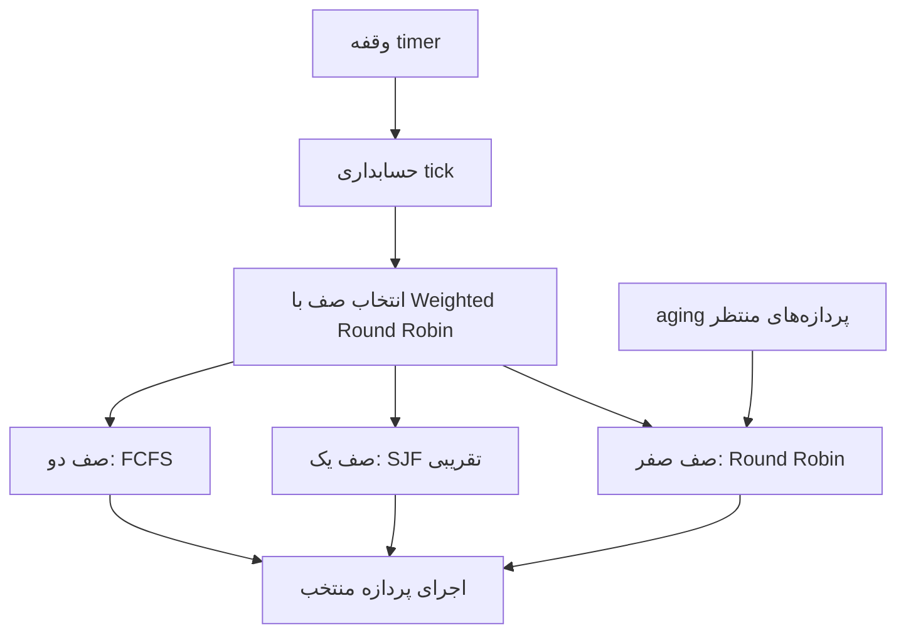

# خلاصه اجرایی

در پروژه سوم تمرکز روی زمان‌بندی پردازه‌ها در xv6 بود. xv6 در حالت اولیه یک scheduler ساده دارد که پردازه‌های `RUNNABLE` را به شکل round-robin انتخاب می‌کند. هدف این پروژه این بود که ابتدا چرخه حیات پردازه و ساختار PCB در xv6 را بشناسیم و سپس scheduler را به یک زمان‌بند چندصفی تبدیل کنیم.

در پیاده‌سازی این پروژه سه صف اصلی در نظر گرفته شد:

1. صف صفر: Round Robin با quantum پنج tick؛
2. صف یک: SJF تقریبی با burst time و confidence؛
3. صف دو: FCFS بر اساس زمان ورود به صف.

انتخاب بین صف‌ها با Weighted Round Robin انجام می‌شود تا هیچ صفی کاملاً حذف نشود. همچنین برای جلوگیری از starvation، مکانیزم aging اضافه شد تا پردازه‌هایی که مدت زیادی `RUNNABLE` مانده‌اند به صف بالاتر منتقل شوند.

> [!NOTE]
> در این گزارش زمان‌بند جدید به عنوان یک توسعه روی scheduler ساده xv6 توضیح داده شده است؛ یعنی ابتدا رفتار پیش‌فرض xv6 بررسی می‌شود و بعد نشان داده می‌شود که هر فیلد و هر syscall جدید چه نقشی در تصمیم زمان‌بندی دارد.

نمودار زیر ساختار کلی صف‌های زمان‌بند چندصفی را نشان می‌دهد:



برای تخمین زمان اجرای بعدی در ایده SJF می‌توان از یک وزن اعتماد استفاده کرد:

$$
\begin{aligned}
{}B_{new} &= \alpha B_{given} + (1-\alpha)B_{old}
\end{aligned}
$$

# فایل‌های اصلی تغییر داده‌شده

| فایل                                                        | نقش                                                                                                      |
| --------------------------------------------------------------- | ----------------------------------------------------------------------------------------------------------- |
| `proc.h`                                                      | اضافه شدن فیلدهای زمان‌بندی به `struct proc` و `struct cpu`                  |
| `proc.c`                                                      | پیاده‌سازی RR، SJF تقریبی، FCFS، WRR، aging و syscallهای کمکی scheduler         |
| `trap.c`                                                      | فراخوانی tickهای scheduler هنگام وقفه timer                                             |
| `exec.c`                                                      | تنظیم صف پیش‌فرض پردازه‌ها بعد از `exec` و حفظ shell در صف مناسب |
| `sysproc.c`                                                   | پیاده‌سازی wrapperهای kernel برای syscallهای زمان‌بندی                         |
| `syscall.h`, `syscall.c`, `user.h`, `usys.S`            | ثبت syscallهای جدید                                                                               |
| `schedtest.c`                                                 | برنامه تست عمومی scheduler                                                                    |
| `workload_short.c`, `workload_long.c`, `workload_mixed.c`, `workload_aging.c` | برنامه‌های ارزیابی رفتار زمان‌بند و نمایش aging                                             |

# پاسخ پرسش‌های مفهومی پردازه و scheduler

## ۱.بررسی PCB و stateهای پردازه در xv6

در xv6 ساختار PCB همان `struct proc` در فایل `proc.h` است. چند نمونه از فیلدهای آن و معادل مفهومی آن‌ها در مدل‌های رایج سیستم‌عامل:

| مفهوم در PCB         | فیلد در xv6   | توضیح                                                |
| --------------------------- | ------------------- | --------------------------------------------------------- |
| شناسه پردازه     | `pid`             | شماره یکتای پردازه                        |
| وضعیت پردازه     | `state`           | یکی از وضعیت‌های `UNUSED` تا `ZOMBIE` |
| اطلاعات حافظه   | `sz`, `pgdir`   | اندازه حافظه و page table                     |
| متن اجرایی CPU     | `context`, `tf` | context برای swtch و trapframe برای trap/syscall |
| والد پردازه       | `parent`          | رابطه درختی پردازه‌ها                  |
| فایل‌های باز     | `ofile[]`         | منابع فایل متعلق به پردازه          |
| دایرکتوری جاری | `cwd`             | مسیر کاری پردازه                            |
| نام پردازه         | `name`            | کمک به debug و نمایش                           |

وضعیت‌های تعریف‌شده در xv6 عبارت‌اند از:

```c
enum procstate { UNUSED, EMBRYO, SLEEPING, RUNNABLE, RUNNING, ZOMBIE };
```

## ۲. معادل وضعیت‌های xv6 در چرخه حیات پردازه

| وضعیت xv6 | معادل مفهومی در چرخه حیات                               |
| -------------- | ---------------------------------------------------------------------------- |
| `UNUSED`     | خانه خالی، هنوز پردازه‌ای وجود ندارد          |
| `EMBRYO`     | new / در حال ساخته شدن                                          |
| `RUNNABLE`   | ready / آماده اجرا                                                  |
| `RUNNING`    | running / در حال اجرا روی CPU                                    |
| `SLEEPING`   | waiting یا blocked / منتظر رخداد                                 |
| `ZOMBIE`     | terminated / پایان یافته ولی هنوز جمع‌آوری نشده |

## ۳. گذار new به ready در xv6

برای ساخت پردازه جدید، تابع `allocproc` یک خانه آزاد از جدول پردازه‌ها پیدا می‌کند و state را از `UNUSED` به `EMBRYO` تغییر می‌دهد. سپس در `userinit` برای اولین پردازه و در `fork` برای پردازه‌های بعدی، پس از کامل شدن مقداردهی، state به `RUNNABLE` تغییر می‌کند.

پس گذار مفهومی new به ready در xv6 به صورت زیر است:

```text
UNUSED -> EMBRYO -> RUNNABLE
```

تابع‌های مهم در این مسیر `allocproc`, `userinit` و `fork` هستند.

## ۴. سقف تعداد پردازه‌ها در xv6

حداکثر تعداد پردازه‌ها در `param.h` با `NPROC` مشخص شده است:

```c
#define NPROC 64
```

اگر یک پردازه بیش از این تعداد child بسازد، `allocproc` خانه آزاد پیدا نمی‌کند و `fork` مقدار `-1` برمی‌گرداند. kernel در حالت عادی panic نمی‌کند؛ برنامه user خطای fork را از مقدار برگشتی می‌فهمد.

## ۵. چرا scheduler باید جدول پردازه‌ها را قفل کند؟

جدول پردازه‌ها یک ساختار مشترک است. در سیستم چندپردازنده‌ای، ممکن است دو CPU هم‌زمان scheduler خود را اجرا کنند یا یکی در حال fork/exit/sleep/wakeup باشد و دیگری در حال انتخاب پردازه. اگر `ptable.lock` نباشد، دو CPU می‌توانند یک پردازه را هم‌زمان انتخاب کنند یا stateها ناسازگار شوند.

حتی در سیستم تک‌پردازنده نیز وقفه‌ها و مسیرهای مختلف kernel می‌توانند state پردازه را تغییر دهند. بنابراین قفل کردن جدول پردازه‌ها هم برای SMP و هم برای حفظ invariantهای kernel لازم است، هرچند در تک‌پردازنده بعضی raceها کمتر رخ می‌دهند.

## ۶. ثبات Program Counter در `context`

در ساختار `context`، معادل program counter ثبات `eip` است:

```c
struct context {
  uint edi;
  uint esi;
  uint ebx;
  uint ebp;
  uint eip;
};
```

در `swtch.S` مقدار `eip` به صورت مستقیم با دستور خاص ذخیره نمی‌شود؛ بلکه آدرس بازگشت تابع روی stack وجود دارد. وقتی `esp` ذخیره می‌شود، layout stack طوری است که این آدرس بازگشت در جای فیلد `eip` ساختار context قرار می‌گیرد. هنگام بازگرداندن context، `ret` باعث می‌شود اجرا از همان `eip` ادامه پیدا کند.

## ۷. چرا ابتدای scheduler از `sti` استفاده می‌شود؟

`scheduler` در ابتدای حلقه interrupts را فعال می‌کند تا CPU هنگام بیکار بودن یا جست‌وجوی پردازه، وقفه‌های timer و device را دریافت کند. اگر وقفه‌ها غیرفعال بمانند، رخدادهایی مثل پایان I/O یا tick timer پردازش نمی‌شوند و ممکن است پردازه‌های sleeping بیدار نشوند یا سیستم عملا متوقف شود.

## ۸. وقفه timer هر چند وقت یک بار رخ می‌دهد؟

در xv6 واحد اصلی زمان‌بندی `tick` است. در این پروژه طبق صورت پروژه، پنج tick معادل حدود ۵۰ میلی‌ثانیه در نظر گرفته شده است؛ بنابراین هر tick تقریباً ۱۰ میلی‌ثانیه است. مقدار دقیق wall-clock در QEMU ممکن است به تنظیمات شبیه‌ساز وابسته باشد، ولی scheduler بر اساس شمارنده `ticks` تصمیم می‌گیرد.

## ۹. گذار interrupt در چرخه حیات پردازه

وقتی وقفه timer رخ می‌دهد و پردازه فعلی در state `RUNNING` است، در `trap.c` تابع `yield` صدا زده می‌شود. `yield` state پردازه را به `RUNNABLE` تغییر می‌دهد و سپس با `sched` کنترل را به scheduler برمی‌گرداند. پس گذار مربوط به interrupt به صورت زیر است:

```text
RUNNING -> RUNNABLE
```

## ۱۰. بررسی quantum زمان‌بندی round-robin در xv6

در xv6 اولیه، پردازه در هر timer interrupt می‌تواند yield کند؛ بنابراین quantum موثر تقریباً یک tick است. در پیاده‌سازی این پروژه برای صف RR، quantum برابر پنج tick تعریف شد:

```c
#define SCHED_RR_QUANTUM_TICKS 5
```

با فرض ۱۰ میلی‌ثانیه برای هر tick، quantum صف RR حدود ۵۰ میلی‌ثانیه است.

## ۱۱. تابع `wait` در نهایت از چه تابعی برای منتظر ماندن استفاده می‌کند؟

در `wait`، اگر فرزند zombie وجود نداشته باشد ولی هنوز child زنده‌ای وجود داشته باشد، پردازه والد با تابع `sleep` می‌خوابد:

```c
sleep(curproc, &ptable.lock);
```

وقتی child در `exit` تمام می‌شود، parent با `wakeup1` بیدار می‌شود.

## ۱۲. استفاده‌های دیگر `sleep`

علاوه بر `wait`، از `sleep` در بخش‌های دیگری نیز استفاده می‌شود. مثال‌ها:

- در `sys_sleep`، پردازه روی `ticks` می‌خوابد تا زمان مورد نظر بگذرد.
- در pipe، اگر pipe خالی باشد reader می‌خوابد و اگر pipe پر باشد writer می‌خوابد.
- در بعضی مسیرهای I/O، پردازه تا آماده شدن رخداد مورد نظر sleep می‌شود.

## ۱۳. تابع sleep چه گذار وضعیتی ایجاد می‌کند؟

تابع `sleep` پردازه در حال اجرا را روی یک channel می‌خواباند. بنابراین گذار اصلی آن:

```text
RUNNING -> SLEEPING
```

بعد از `wakeup`، اگر رخداد مورد نظر اتفاق افتاده باشد، پردازه دوباره `RUNNABLE` می‌شود.

## ۱۴. برخورد xv6 با پردازه orphan

اگر parent زودتر از child تمام شود، child یتیم یا orphan می‌شود. xv6 در تابع `exit` فرزندان پردازه خارج‌شده را به `initproc` می‌سپارد. سپس `init` با `wait` پردازه‌های zombie را جمع‌آوری می‌کند. این کار باعث می‌شود zombieها در سیستم باقی نمانند.

# طراحی زمان‌بند چندصفی

## صف‌ها و ثابت‌ها

در `proc.h` سه صف تعریف شد:

```c
#define SCHED_Q_RR     0
#define SCHED_Q_SJF    1
#define SCHED_Q_FCFS   2
#define SCHED_NQUEUE   3
```

همچنین quantum و aging به صورت ثابت تعریف شدند:

```c
#define SCHED_RR_QUANTUM_TICKS 5
#define SCHED_WRR_UNIT_TICKS   10
#define SCHED_AGING_TICKS      800
```

## فیلدهای اضافه‌شده به `struct proc`

برای اینکه scheduler بتواند تصمیم بگیرد، چند فیلد به PCB اضافه شد:

| فیلد                    | نقش                                                                                            |
| --------------------------- | ------------------------------------------------------------------------------------------------- |
| `sched_queue`             | شماره صف فعلی پردازه                                                             |
| `sched_wait_ticks`        | تعداد tickهایی که پردازه در حالت `RUNNABLE` منتظر مانده است |
| `sched_burst_time`        | تخمین زمان اجرای پردازه برای SJF                                          |
| `sched_confidence`        | میزان اعتماد به تخمین burst                                                     |
| `sched_consecutive_ticks` | تعداد tickهای اجرای پشت سر هم                                                 |
| `sched_arrival_tick`      | tick ورود پردازه به صف فعلی                                                     |
| `sched_shell_path`        | علامت برای حفظ مسیر shell در صف مناسب                                    |

برای هر CPU نیز وضعیت WRR نگهداری می‌شود:

| فیلد              | نقش                                                           |
| --------------------- | ---------------------------------------------------------------- |
| `sched_queue`       | صفی که CPU فعلا سهم آن را مصرف می‌کند  |
| `sched_queue_ticks` | تعداد tickهای مصرف‌شده از سهم صف فعلی |
| `sched_rr_next`     | اندیس شروع بعدی برای RR صف صفر             |

# الگوریتم‌های داخلی صف‌ها

## صف صفر: Round Robin

در صف صفر، پردازه‌های `RUNNABLE` به شکل round-robin انتخاب می‌شوند. برای اینکه هر بار از ابتدای `ptable` شروع نشود، در `struct cpu` فیلد `sched_rr_next` نگه داشته می‌شود. هر پردازه در این صف حداکثر پنج tick پشت سر هم اجرا می‌شود و سپس با `yield` به scheduler برمی‌گردد.

## صف یک: SJF تقریبی

در سیاست SJF واقعی، دانستن زمان اجرای آینده پردازه نیاز است که در عمل ممکن نیست. بنابراین در این پروژه هر پردازه دو مقدار دارد:

- `sched_burst_time`: تخمین زمان اجرا؛
- `sched_confidence`: درصد اعتماد به تخمین.

ابتدا پردازه‌ها بر اساس burst کمتر، arrival قدیمی‌تر و سپس pid کمتر مرتب می‌شوند. سپس با استفاده از confidence، انتخاب پردازه کوتاه‌تر به صورت احتمالی انجام می‌شود. اگر confidence بالا باشد، احتمال انتخاب پردازه با burst کمتر بیشتر است. این روش تقریبی است و هدف آن نزدیک شدن به ایده SJF بدون نیاز به پیش‌گویی قطعی آینده است.

## صف دو: FCFS

در صف FCFS، پردازه‌ای انتخاب می‌شود که زودتر وارد صف شده باشد. این زمان در `sched_arrival_tick` ذخیره می‌شود. اگر دو پردازه arrival یکسان داشته باشند، pid کمتر اولویت دارد تا رفتار deterministicتر شود.

# انتخاب بین صف‌ها با WRR

اگر همیشه صف بالاتر اولویت مطلق داشته باشد، صف‌های پایین ممکن است دچار starvation شوند. برای همین انتخاب بین صف‌ها با Weighted Round Robin انجام شد. وزن‌ها به شکل زیر هستند:

| صف | الگوریتم داخلی | سهم      |
| ---- | --------------------------- | ----------- |
| ۰   | RR                          | ۳ واحد |
| ۱   | SJF تقریبی            | ۲ واحد |
| ۲   | FCFS                        | ۱ واحد |

هر واحد ۱۰ tick است، پس صف‌ها به ترتیب ۳۰، ۲۰ و ۱۰ tick سهم می‌گیرند. اگر صف فعلی پردازه `RUNNABLE` نداشته باشد یا سهم آن تمام شود، CPU به صف بعدی می‌رود.

# سازوکار aging و جلوگیری از starvation

در هر tick، تابع `scheduler_waiting_tick` پردازه‌های `RUNNABLE` را بررسی می‌کند. فقط پردازه‌هایی waiting حساب می‌شوند که واقعا آماده اجرا هستند ولی CPU نگرفته‌اند. اگر پردازه‌ای در صف FCFS مدت زیادی منتظر بماند، به SJF منتقل می‌شود. اگر در SJF هم مدت زیادی منتظر بماند، به RR منتقل می‌شود:

```text
FCFS -> SJF -> RR
```

دلیل اینکه زمان `SLEEPING` حساب نمی‌شود این است که پردازه sleeping آماده استفاده از CPU نیست؛ مثلاً منتظر I/O یا رخداد دیگری است. waiting از دید scheduler یعنی پردازه می‌توانسته اجرا شود ولی انتخاب نشده است. در نسخه نهایی، هر بار که aging فعال شود، kernel بعد از آزاد کردن `ptable.lock` پیام زیر را چاپ می‌کند تا هم الزام صورت پروژه رعایت شود و هم ترتیب قفل‌های console و process table خطرناک نشود:

```text
aging: pid <pid> promoted from queue <old> to queue <new>
```

# تغییرات لازم در `exec` و رفتار shell

طبق صورت پروژه، پردازه اولیه و shell باید در صف اول باقی بمانند، ولی برنامه‌هایی که از shell با `exec` اجرا می‌شوند به صف پیش‌فرض منتقل شوند. برای این کار تابع `scheduler_on_exec` بعد از موفق شدن `exec` صدا زده می‌شود.

در `exec.c` ابتدا نام برنامه در `curproc->name` کپی می‌شود و سپس بعد از commit شدن image جدید، scheduler با همین نام تصمیم می‌گیرد:

```c
safestrcpy(curproc->name, last, sizeof(curproc->name));
...
scheduler_on_exec(curproc->name);
```

اگر نام `init` یا `sh` باشد، پردازه در صف RR باقی می‌ماند. در غیر این صورت به صف پیش‌فرض FCFS منتقل می‌شود. این کار باعث می‌شود shell تعاملی responsive بماند، ولی برنامه‌های عادی به شکل کنترل‌شده وارد scheduler چندصفی شوند.

# فراخوانی‌های سیستمی اضافه‌شده برای زمان‌بندی

سه syscall برای کنترل و مشاهده scheduler اضافه شد:

```c
int set_scheduling_info(int pid, int burst, int confidence);
int change_queue(int pid, int q);
int print_scheduling_info(void);
```

## `set_scheduling_info`

این syscall تخمین burst و confidence پردازه را تنظیم می‌کند. مقدار `burst` باید مثبت باشد و confidence باید بین صفر و صد باشد. این اطلاعات در صف SJF استفاده می‌شود.

## `change_queue`

این syscall پردازه را به صف مشخص منتقل می‌کند و `sched_arrival_tick` را به tick فعلی تغییر می‌دهد. اگر صف نامعتبر باشد، مقدار `-1` برمی‌گردد. همچنین برای حفظ پاسخ‌گویی سیستم، انتقال `init` و مسیر shell به صفی غیر از صف صفر رد می‌شود.

## `print_scheduling_info`

این syscall جدول پردازه‌ها را با اطلاعات زمان‌بندی چاپ می‌کند. ستون‌های خروجی شامل نام، pid، state، queue، wait، confidence، burst، consecutive و arrival هستند. در نسخه نهایی ابتدا snapshot اطلاعات پردازه‌ها زیر `ptable.lock` گرفته می‌شود، سپس lock آزاد می‌شود و چاپ انجام می‌گیرد؛ بنابراین هنگام `cprintf`، قفل جدول پردازه‌ها نگه داشته نمی‌شود.

نمونه قالب خروجی:

```text
name            pid state     queue wait confidence burst consecutive arrival
sh              2   SLEEPING  0     0    50         2     0           10
schedtest       4   RUNNING   2     0    50         2     1           120
```

# پاسخ پرسش‌های مربوط به زمان‌بند جدید

## ۱۵. با `CPUS=2` آیا ترتیب قبلی حفظ می‌شود؟

خیر، در حالت دو CPU ترتیب دقیق اجرا مانند حالت تک‌پردازنده قابل تکرار نیست. در `CPUS=1` فقط یک scheduler فعال است و ترتیب اجرا ساده‌تر دیده می‌شود. اما در `CPUS=2` هر CPU scheduler خودش را دارد و هر دو از جدول مشترک پردازه‌ها پردازه انتخاب می‌کنند. قفل `ptable.lock` از race جلوگیری می‌کند، ولی interleaving دو CPU باعث می‌شود ترتیب چاپ خروجی و ترتیب اجرای دقیق پردازه‌ها تغییر کند.

## ۱۶. اثر سیاست‌های SJF، FCFS و time-slice روی starvation

در SJF خالص، پردازه‌های طولانی ممکن است پشت پردازه‌های کوتاه زیاد منتظر بمانند. در FCFS، starvation داخل همان صف کمتر است، چون ترتیب ورود رعایت می‌شود، اما اگر صف‌های بالاتر همیشه مشغول باشند ممکن است صف پایین دیرتر CPU بگیرد. در RR، همه پردازه‌های صف به شکل نوبتی CPU می‌گیرند و برای کارهای تعاملی مناسب‌تر است.

در پیاده‌سازی این پروژه، WRR بین صف‌ها و aging دو ابزار اصلی برای کاهش starvation هستند. WRR تضمین می‌کند که صف‌های پایین نیز سهمی از CPU داشته باشند و aging باعث می‌شود پردازه‌ای که مدت زیادی منتظر مانده، به صف بالاتر منتقل شود.

## ۱۷. چرا زمان `SLEEPING` waiting حساب نمی‌شود؟

پردازه sleeping آماده اجرا نیست و حتی اگر CPU آزاد باشد نمی‌تواند جلو برود، چون منتظر رخدادی مانند I/O، pipe یا timer است. اگر زمان sleeping را waiting حساب کنیم، پردازه‌ای که بیشتر I/O انجام می‌دهد ممکن است بی‌دلیل به صف بالاتر ارتقا پیدا کند. بنابراین فقط زمان `RUNNABLE` بودن معیار انتظار زمان‌بندی قرار گرفت.

# برنامه‌های تست زمان‌بندی

## `schedtest`

این برنامه شش child می‌سازد و برای هر کدام queue، burst و confidence مشخص می‌کند. parent بعد از fork و قبل از شروع کار child، با pid برگشتی تنظیمات را اعمال می‌کند. برای جلوگیری از race، بین parent و child از pipe استفاده شده است؛ child تا وقتی parent تنظیمات را انجام نداده شروع به مصرف CPU نمی‌کند.

```sh
$ schedtest
schedtest: creating 6 CPU-bound children
schedtest: q0=RR, q1=approx-SJF, q2=FCFS
...
```

این تست برای مشاهده هم‌زمان سه صف و خروجی `print_scheduling_info` استفاده شد. در نسخه نهایی چاپ خطوط شروع/پایان childها از parent انجام می‌شود تا در `CPUS=2` خروجی user-level داخل هم نرود.

## `workload_short`

این برنامه چند پردازه سبک و کوتاه می‌سازد و آن‌ها را در صف RR قرار می‌دهد. انتظار می‌رود پردازه‌های کوتاه با RR پاسخ‌گویی خوبی داشته باشند و هیچ child مدت زیادی منتظر نماند.

```sh
$ workload_short
```

## `workload_long`

این برنامه چند پردازه سنگین‌تر می‌سازد و آن‌ها را در صف FCFS قرار می‌دهد. هدف مشاهده رفتار FCFS برای کارهای طولانی‌تر است. در این حالت پردازه‌ای که زودتر وارد صف شده باشد اول اجرا می‌شود.

```sh
$ workload_long
```

## `workload_mixed`

این برنامه ترکیبی از پردازه‌های کوتاه و طولانی را بین هر سه صف پخش می‌کند. هدف این تست مشاهده اثر WRR است؛ یعنی صف‌های بالاتر پاسخ‌گوتر باشند ولی صف‌های پایین هم کاملاً بی‌نصیب نمانند.

```sh
$ workload_mixed
```

## `workload_aging`

این برنامه برای نمایش مستقیم aging اضافه شد. یک child طولانی در صف FCFS قرار می‌گیرد و چند child دیگر در همان صف منتظر می‌مانند. در حالت `CPUS=1` بعد از حدود ۸۰۰ tick باید پیام promotion از طرف kernel چاپ شود.

```sh
$ workload_aging
aging: pid 12 promoted from queue 2 to queue 1
```

# مقایسه الگوریتم‌ها برای workloadها

| workload                                                   | رفتار مناسب‌تر | دلیل                                                                                                                           |
| ---------------------------------------------------------- | --------------------------- | ---------------------------------------------------------------------------------------------------------------------------------- |
| کوتاه و تعاملی                                 | RR                          | quantum کوتاه باعث پاسخ‌گویی بهتر و تقسیم عادلانه CPU می‌شود                              |
| محاسباتی کوتاه با burst قابل تخمین | SJF تقریبی            | پردازه‌های کوتاه‌تر زودتر تمام می‌شوند و میانگین زمان انتظار کم می‌شود |
| کارهای طولانی و ترتیبی                  | FCFS                        | پیاده‌سازی ساده و رعایت ترتیب ورود، مناسب برای jobهای batch ساده                     |
| ترکیبی                                               | MFQ/WRR همراه aging    | بین پاسخ‌گویی، throughput و جلوگیری از starvation تعادل ایجاد می‌کند                        |

در عمل، هیچ الگوریتمی برای همه شرایط بهترین نیست. به همین دلیل استفاده از چند صف و ترکیب سیاست‌ها منطقی است: RR برای responsiveness، SJF برای کاهش زمان انتظار کارهای کوتاه، FCFS برای ترتیب ساده، و aging برای جلوگیری از گرسنگی پردازه‌ها.

# راهنمای build و اجرای پروژه

برای build:

```bash
make clean
make
make fs.img
```

برای اجرای تک‌پردازنده و مشاهده ترتیب ساده‌تر:

```bash
make qemu-nox CPUS=1
```

برای اجرای دوپردازنده‌ای:

```bash
make qemu-nox CPUS=2
```

برنامه‌های تست داخل xv6:

```sh
schedtest
workload_short
workload_long
workload_mixed
workload_aging
```


# اعتبارسنجی نهایی و سلامت تحویل

در بازبینی نهایی، علاوه بر build عادی، مسیر `make dist` و build مجدد از `dist` نیز بررسی شد؛ چون در پروژه‌های xv6، ناقص بودن `EXTRA` در `Makefile` یکی از خطاهای رایج تحویل است.

| مورد بررسی | نتیجه |
|---|---|
| `make clean` | موفق |
| `make` | موفق |
| `make fs.img` | موفق |
| `make dist` | موفق |
| `cd dist && make fs.img` | موفق |
| `cd dist && make` | موفق |
| dry-run اجرای `CPUS=4` | تولید topology صریح برای QEMU با `-smp cpus=4,cores=1,threads=1,sockets=4` |

اصلاحات نهایی بازبینی:

1. در `Makefile`، برنامه‌های `schedtest.c`، `workload_short.c`، `workload_long.c`, `workload_mixed.c` و `workload_aging.c` به `EXTRA` اضافه شدند تا خروجی `dist` بعد از `make clean` هم بتواند همه `_UPROGS`های زمان‌بندی را بسازد.
2. `picirq.c` نیز به `EXTRA` اضافه شد تا build kernel در dist روی toolchain استاندارد کامل بماند.
3. در مسیر `wakeup` و `kill`، وقتی پردازه از `SLEEPING` به `RUNNABLE` برمی‌گردد، metadata زمان‌بندی شامل `sched_wait_ticks`، `sched_consecutive_ticks` و `sched_arrival_tick` تازه‌سازی می‌شود. این کار برای FCFS، tie-break در SJF و aging لازم است.
4. تابع `print_scheduling_info` به روش snapshot-then-print اصلاح شد تا `ptable.lock` هنگام چاپ روی console نگه داشته نشود.
5. aging اکنون پیام الزامی pid و صف مبدا/مقصد را چاپ می‌کند.
6. تست‌های user-level در حالت `CPUS=2` خروجی تمیزتری دارند، چون childها دیگر مستقیم روی console چاپ نمی‌کنند.

برنامه‌های تست اصلی داخل xv6:

```sh
schedtest
workload_short
workload_long
workload_mixed
workload_aging
```


# جمع‌بندی

در این پروژه ابتدا ساختار PCB، stateهای پردازه، sleep/wakeup، wait، yield و trap timer در xv6 بررسی شد. سپس scheduler ساده xv6 به یک زمان‌بند چندصفی تبدیل شد. سه سیاست RR، SJF تقریبی و FCFS در صف‌های جدا پیاده‌سازی شدند و انتخاب بین صف‌ها با WRR انجام شد. برای جلوگیری از starvation، aging اضافه شد. همچنین syscallهایی برای تنظیم و مشاهده اطلاعات زمان‌بندی نوشته شد و چند workload برای بررسی رفتار scheduler در حالت‌های مختلف طراحی شد. نتیجه این است که xv6 از یک scheduler آموزشی ساده به نمونه‌ای قابل مشاهده از زمان‌بندی چندصفی تبدیل شد.

